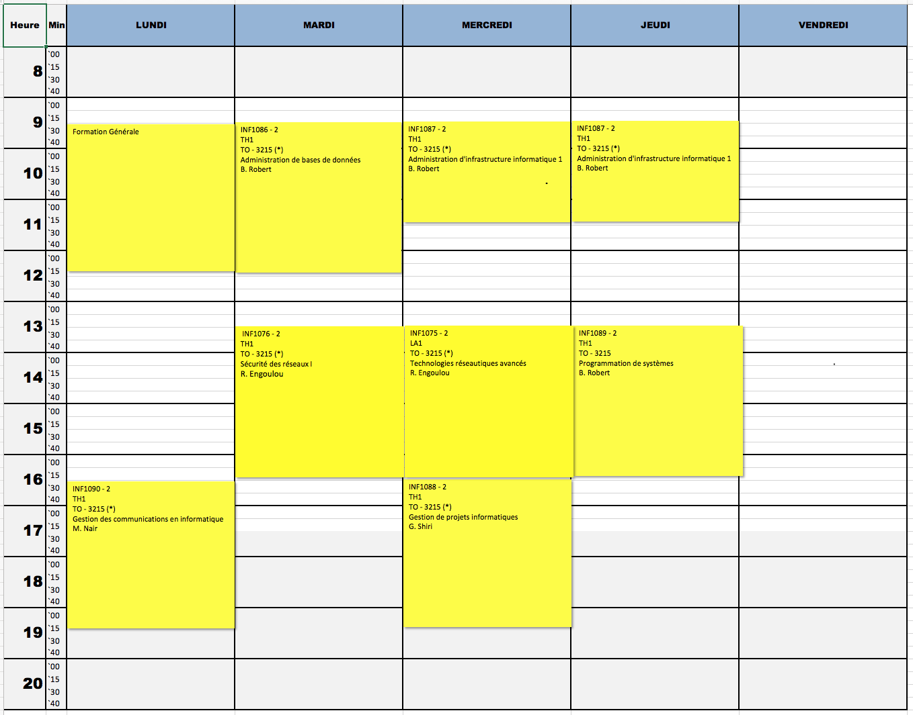

# Hiver 2020

###### :warning: `(*)` Dénote un changement de salle

# Calendrier GINF

# Calendrier GINQ

## ÉTAPE 2

|     Code	                                                     | Titre du cours                              | Commentaires|
|:---------------------------------------------------------------|:--------------------------------------------|:------------|
| INF1011                                                        | Professional Communication in English       |             |
| INF1021                                                        | Protocoles et concepts de routage           |             |
| INF1041                                                        | Introduction à l'administration des systèmes|             |
| [INF1042](https://github.com/CollegeBoreal/INF1042-202-20H-02) | Introduction à la programmation             |             |
| INF1043                                                        | Introduction aux bases de données           |             |
| INF1082                                                        | Appui et service technique                  |             |

## ÉTAPE 4

|     Code	                                                     | Titre du cours                               |Commentaires|
|:---------------------------------------------------------------|:----------------------------------------------|:----------|
| INF1075                                                        | Technologie réseautiques avancés              |           |
| INF1076                                                        | Sécurité des réseaux                          |           |
| [INF1086](https://github.com/CollegeBoreal/INF1086-200-20H-02) | Administration de bases de données            |           |
| [INF1087](https://github.com/CollegeBoreal/INF1087-200-20H-02) | Administration d'infrastructure informatique 1|           |
| INF1088                                                        | Gestion de projets informatiques              |           |
| [INF1089](https://github.com/CollegeBoreal/INF1089-200-20H-02) | Programmation de systèmes                     |           |
| INF1090                                                        | Gestion des communications en informatique    |           |

